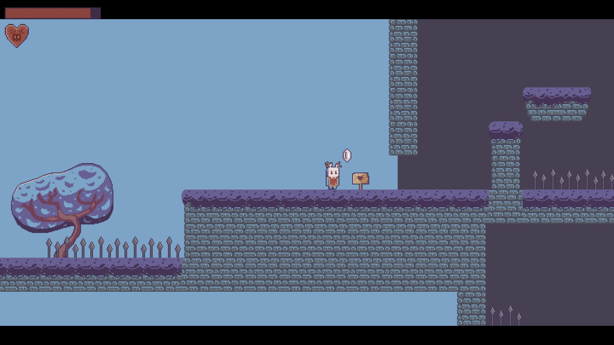

# Кетнаси
## Игра была разработана как дипломный проект и представляет собой демо 2d платформера

- Были реализованы движение главного героя, двойной прыжок, вскарабкивание, анимации
- Было реализовано изменение уровней с количеством жизней (при разном количестве сердец уровни меняют
цветовую гамму и расположение некоторых платформ, форму деревьев)
- Были использованы партиклы
- Были реализованы враги - слизни (их движение, патрулирование, нападение на игрока, смерть)

- Было реализовано оружие в виде:
  - Кристалла, который выпускает луч под 45 градусов вниз и наносит им периодический урон
  - Камушка, которым можно отвлечь врага и нанести ему небольшой урон
  
- Были реализованы препятствия:
  - Камни, которые можно двигать и учичтожать
  - Острые пики, которые наносят урон и отталкивают
  - Облака с дождем, которые замедляют, если попасть под воду
  - Ветер, который замедляет и ускоряет игрока в зависимости от того, куда он идет
  - Деревья, на которые можно забраться и с которых можно слезть
  
- Была создана загадка с лабиринтом, где игрок должен, управляя собой сразу в 4 лабиринтах, пройти их все
- Были реализованы автоматические точки сохранения на разных частях карты
- Были созданы главное меню и настройки
